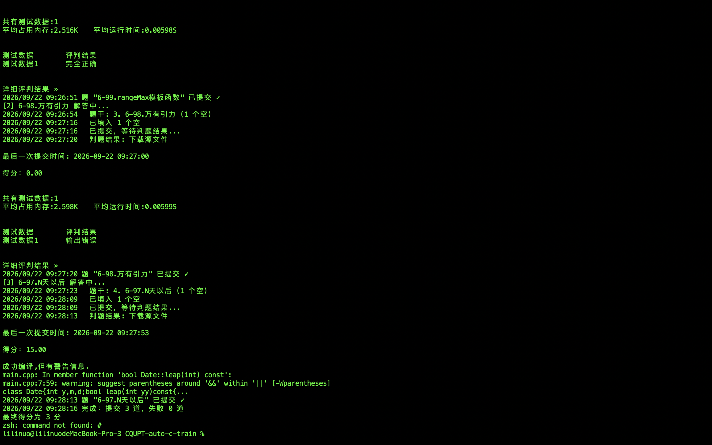

# 重庆邮电大学程序设计平台自动刷题脚本（Windows 11 + Chrome 版）

> **版本：v1.3.0（2026-09-25）** ｜ **平台：Windows 11** ｜ 更新日志见根目录 [CHANGELOG.md](../CHANGELOG.md)

> ⚠️ **仅限个人学习交流，严禁用于任何盈利目的**；使用风险自负（详见根目录 [README](../README.md) 的免责声明）。
> ⭐ 觉得好用的话，欢迎给仓库点个 **Star**。

> macOS 版在另一个文件夹，这份是**专门适配 Windows 11 + Google Chrome** 的版本。

适配站点：https://prg.cqupt.edu.cn （站点有瑞数 WAF 防护，脚本已自动绕过）

## 一、环境准备（Windows 11）

### 1. 安装 Go
到 https://go.dev/dl/ 下载 Windows 版 `go*.msi`，一路下一步安装。装完打开 **PowerShell** 验证：
```powershell
go version
```
看到版本号就 OK。

### 2. 安装 Google Chrome
https://www.google.com/chrome/ 下载安装即可。脚本会自动在以下位置找 `chrome.exe`：
- `%LOCALAPPDATA%\Google\Chrome\Application\chrome.exe`（**无管理员安装时的默认位置**）
- `C:\Program Files\Google\Chrome\Application\chrome.exe`
- `C:\Program Files (x86)\Google\Chrome\Application\chrome.exe`
- 找不到就试 Edge，或用环境变量 `CHROME_PATH` 手动指定

### 3. 安装 Python + 验证码识别库
到 https://www.python.org/downloads/windows/ 下载安装 **Python 3.x**（安装时务必勾选 **Add Python to PATH**）。装完后在 PowerShell 里装识别库：
```powershell
pip install ddddocr
```
脚本会自动探测 `python` / `py` / `python3` 命令。想手动指定解释器就设环境变量 `PYTHON_BIN`。

### 4. 配置 AI 凭据（火山引擎）
到 https://console.volcengine.com/ark 注册开通（有免费额度），创建 **API Key** 和**模型接入点（Model ID）**。

然后把模板复制成正式配置并填入：
```powershell
copy .env.example .env
```
用记事本打开 `.env`，填成这样：
```
ARK_API_KEY=你的API-Key
ARK_MODEL_ID=你的模型ID
```

## 二、运行

在**项目文件夹**里打开 PowerShell（资源管理器地址栏输入 `powershell` 回车即可），然后：

```powershell
# 刷选择/填空题
go run .

# 刷程序片段编程题
go run . -mode=progap

# （可选）生成 Prompt 模板，方便不改代码调提示词
go run . -prompts-init
```

按提示依次输入 **学号 → 密码 → 想刷的题目数量**（建议先填 1~3 验证，确认没问题再放量）。

**v1.2.0 新增**：每题提交前后各读一次页面总分，差值即该题得分；没得分可按策略重答（选择/填空题同页重填，程序题重新打开题目页）。次数用尽仍不得分的题记入 `wrong_answers.md`。

**v1.3.0 新增**：可选的**服务模式**（`go run ./server`，MySQL 队列 + 后台 worker + 进度页），命令行用法完全没变；另外启动浏览器前会先检查 profile / 调试端口是否被另一个 Chrome 占着，占着就直接报错，不再"想办法连上"（那条路会连到别人的浏览器，把 WAF 绕过的前提破坏掉，且**不报错**）。详见下方「服务模式」。

## 三、⚠️ Windows 上的重要注意事项

1. **运行前请先关闭所有已打开的 Chrome 窗口**。Windows 上如果 Chrome 已经在跑，新启动的进程可能把网址丢给已有实例，导致调试端口没开、脚本连不上浏览器。
2. 启动后会有约 **20 秒静默等待**（在过 WAF 挑战），期间不要去点弹出的浏览器窗口。
3. 验证码识别会自动重试 4 次；万一识别不过，脚本会停住让你在弹出来的浏览器里**手动登录**，登录后自动继续。
4. 首次运行会生成 `.chrome-profile` 文件夹保存登录态，之后重跑通常不用再输验证码。
5. 如果浏览器一直连不上，用环境变量指定路径：
   ```powershell
   $env:CHROME_PATH = "C:\Users\你的用户名\AppData\Local\Google\Chrome\Application\chrome.exe"
   go run .
   ```

## 四、项目结构

```
main.go        # CLI 入口（薄壳）：解析参数、交互式问答、打印结果
train/         # ★ 刷题流程本体（v1.3.0 从 main 包抽出来，服务端复用这一层）
  api.go       #   对外接口：Run / Request / Result / 进度事件 / 哨兵错误
  train.go     #   登录 + 过 WAF + 选择/填空题 + 得分闭环
  progap.go    #   程序片段编程题 + 判题回显解析
  preflight.go #   启动前的占用闸门（端口 / profile 锁探测）
config/        # ★ 全部可调项的集中地
  config.go    #   环境变量读取 + 重答策略
  site.go      #   站点选择器/XPath/正则/文案 + 所有超时参数
  env.go       #   平台差异唯一来源（Chrome 路径 / Python 探测 / profile 目录）
ai/            # 大模型调用 + Prompt 管理（prompts.go）
ocr/           # ddddocr 验证码识别
server/        # 服务模式（可选）：HTTP + MySQL 队列 + worker + 进度页
tools/         # 排查用的小工具（cdpdiag / aitest / attachtest / logindump / wafprobe）
```

**站点改版了就改 `config/site.go`，其余代码基本不用动。**

`train` 之所以单独成包：Go **不允许导入 `package main`**，服务端要复用刷题流程，
流程就得先离开 `main` 包。「能跑起来的脚本」和「能被别的代码调用的模块」是两回事。

## 服务模式（可选）

命令行用法没变。这一节是给「让机器排队慢慢刷」准备的——一次刷题要独占一个 Chrome、
一个 profile、一个调试端口，所以一台机器上并发不了，想让多个人提交任务就得排队。

```powershell
# 1) 准备数据库（需要本机有 MySQL；建表 + 建只给 DML 权限的应用账号）
Get-Content server\schema.sql | mysql -uroot -p

# 2) 写服务端配置：用记事本新建 server.env（与 .env 分开，含密钥与数据库口令），写入两行：
#      TASK_SECRET=至少32个字符的随机串
#      DB_PASSWORD=你自己的口令
notepad server.env

# 3) 起服务（默认监听 127.0.0.1:8080）
go run ./server
```

> ⚠️ 别用 `Out-File -Encoding utf8` 生成 `server.env`：Windows PowerShell 5.1 会写进
> UTF-8 **BOM**，godotenv 解析首行时直接报错。v1.3.0 起这种情况会被明确报出来
> （指出是哪个文件、最可能是什么原因）；旧版会**静默跳过**这个文件，
> 于是你只会看到一句莫名其妙的「TASK_SECRET 必填」。用记事本或 VS Code（UTF-8 无 BOM）保存。

提交任务用 `POST /api/tasks`，进度页在 `GET /`。完整的接口表、配置项、
可靠性机制（重试退避 / 续租心跳 / 僵死回收 / 优雅退出）与已知限制见 [`server/README.md`](./server/README.md)。

> ⚠️ 进度页**没有鉴权**，且默认只监听 `127.0.0.1`。要对外暴露必须先加认证。

## 五、参数一览

| 项 | 默认 | 作用 |
|----|------|------|
| `-mode=quiz` | — | 默认，整页选择/填空题 |
| `-mode=progap` | — | 程序片段编程题 |
| `-mode=progapdump` | — | 只 dump 第一道程序题页面到 progap.html（调试用） |
| `-dump` | — | quiz 模式下 dump 答题页到 page.html（调试用） |
| `-log-json` | — | 日志改输出 JSON 格式 |
| `-prompts-init` | — | 生成 prompts.example.json 后退出 |
| `ASSIGN_KEYWORD` | `刷题` | 有多张作业卡时按标题关键词选卡，例如 `$env:ASSIGN_KEYWORD="平时"` |
| `CHROME_PATH` | 自动探测 | 自定义 chrome.exe 路径 |
| `CHROME_USER_DATA` | `.chrome-profile` | 浏览器 profile 目录 |
| `CDP_PORT` | `9223` | 调试端口 |
| `CDP_URL` | 空 | 接入已开着的浏览器，跳过自动登录 |
| `PYTHON_BIN` | 自动探测 | 自定义 python 解释器路径 |
| `REANSWER_THRESHOLD` | `0` | 得分 ≤ 此值即重答；`-1` = 从不重答 |
| `MAX_ANSWER_TRY` | `2` | 单题最多作答次数（含首次），最小 1 |
| `PROMPTS_FILE` | `prompts.json` | Prompt 覆盖文件路径 |
| `LOG_FORMAT` | `text` | 日志格式：`text` / `json` |

> 想要「和旧版 v1.1.1 完全一样」的行为：设 `MAX_ANSWER_TRY=1` 或 `REANSWER_THRESHOLD=-1`。

## 六、开发 / 自测

```powershell
go build ./...     # 编译
go vet ./...       # 静态检查
go test ./...      # 单测（89 个测试函数 / 151 个用例，默认跳过需要数据库的部分）
```

需要 MySQL 的那部分测试要显式给 DSN 才会跑（不给就自动跳过）：

```powershell
$env:CQUPT_TEST_DSN = 'cqupt_app:口令@tcp(127.0.0.1:3306)/cqupt_train?parseTime=true&loc=Local&charset=utf8mb4'
go test ./...
```

## 七、常见问题

| 现象 | 原因 / 处理 |
|------|------------|
| `未找到 Chrome/Edge 浏览器` | 用 `CHROME_PATH` 指定 chrome.exe |
| `OCR 执行失败` | `pip install ddddocr` 没装好，或 Python 没加入 PATH；设 `PYTHON_BIN` 指定 |
| `浏览器调试资源已被占用` | 另一个 Chrome 已占着 profile 或 `CDP_PORT`。退出所有 Chrome（或用任务管理器结束残留的 chrome.exe），或换 `CDP_PORT` / `CHROME_USER_DATA` |
| 页面空白 / 一直连不上 | 先关掉所有 Chrome 窗口再跑；再用 `go run ./tools/cdpdiag -headless` 看卡在哪一步 |
| `ai初始化失败` | `.env` 没建或 Key 填错（注意别用 `copy` 出来的模板原名 `.env.example`） |
| 某题得分 0 | 模型能力问题，可换更强的模型接入点；或调高 `REANSWER_THRESHOLD` 让它多试几次 |
| 反复重答还是 0 分 | 说明模型确实做不出来，题目会记进 `wrong_answers.md` |
| 想省 token | 设 `MAX_ANSWER_TRY=1`，只答一次不重试 |

## 效果图


